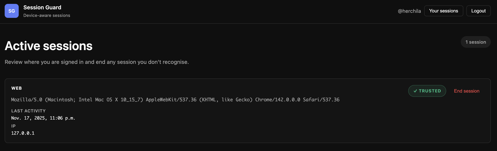

# Session Guard

[](https://github.com/herchila/session-guard/actions/workflows/tests.yml)
[](https://github.com/herchila/session-guard/actions/workflows/pre-commit.yml)
[](LICENSE)

**Device-aware session management for Django.**
Session Guard issues server-side Device IDs (DIDs), tracks active sessions per device, and exposes a simple “Your sessions” view so users can see and revoke their sessions (Google-style).

> ⚠️ Status: Early alpha (v0.1). API may change.

---

## Features (v0.1 - Web sessions only)



Current MVP focuses on **web sessions** only (no OIDC / mobile yet):

- **Server-issued Device ID**
  - Middleware mints a DID and stores it in an HttpOnly, HMAC-signed cookie.
  - Exposes `request.did` and `request.did_trusted` in every request.

- **Device & session models**
  - `Device`: one logical browser/app per user + device_id.
  - `DeviceSession`: one active session per `(user, device, session_type)`.
  - Simple fields for UA family, masked IP, trusted flag and timestamps.

- **Login integration**
  - Helper service `upsert_on_login(request, user, ...)`:
    - Upserts the `Device`.
    - Ensures only one active `DeviceSession` per `(user, device, session_type)`.
  - Meant to be wired into `user_logged_in` signal or custom login view.

- **Session revocation**
  - `revoke_session(user, device_session)`:
    - Marks the `DeviceSession` as inactive.
    - Deletes the corresponding Django `Session` row (logs the user out).
  - `revoke_all_except_current(request, user)` helper included.

- **Admin & demo UI**
  - Django admin registrations for `Device` and `DeviceSession`.
  - Demo page `/account/sessions/`:
    - Lists the user’s active web sessions.
    - Allows revoking a session with a single click.


## Next version (v0.2)

Planned work for upcoming versions includes:

- **Device verification**
  - Mark devices as verified via email or mobile approval flows.
- **OIDC / mobile support**
  - Track sessions for OIDC RPs and mobile/API clients.
- **JWT revocation**
  - Store revoked JWTs (e.g. in Redis) with TTL-based invalidation.

> These are not part of `v0.1` yet, but the data model and service API are designed with them in mind.

## Requirements

- **Python**: 3.10+
- **Django**: 3.2, 4.x or 5.x
- **Poetry** for dependency management (for local development)

The demo project uses SQLite by default.

---

## Getting started (local demo)

### 1. Clone the repository

```bash
git clone https://github.com/herchila/session-guard.git
cd session-guard
```

### 2. Install dependencies

If you don’t have Poetry:

```bash
pip install poetry
```

Then install the project dependencies:
```bash
poetry install
```

All commands below assume you run them via Poetry:
```bash
poetry run <command>
```

### 3. Create and migrate the demo database

The demo Django project lives in the `demo/` folder.

```bash
poetry run python demo/manage.py migrate
```

### 4. Create a superuser

```bash
poetry run python demo/manage.py createsuperuser
```

Follow the prompts to create an admin user.


### 5. Run the development server

```bash
poetry run python demo/manage.py runserver
```

Open your browser at:

* Admin: http://localhost:8000/admin/
* Active sessions UI: http://localhost:8000/account/sessions/

### 6. Try the demo flow

1. Go to /admin/ or /account/sessions/.
2. Log in with the superuser you created.
3. Navigate to Active sessions (/account/sessions/).
4. You should see:
    * A card for your current WEB session.
    * User agent and IP information.
    * A Trusted / Not verified status.
    * An End session button.

Click **End session** to revoke that session.
The underlying `DeviceSession` is marked inactive and the Django server session is deleted.

## Basic integration into your own project (preview)

> This is a quick overview of how the demo integrates Session Guard. The public API may grow/change as the project evolves.

### 1. Install the package (once it’s published to PyPI):

```bash
pip install session-guard
```

### 2. Add the app and middleware:

```python
# settings.py

INSTALLED_APPS = [
    ...
    "session_guard",
]

MIDDLEWARE = [
    "django.middleware.security.SecurityMiddleware",
    "django.contrib.sessions.middleware.SessionMiddleware",
    "session_guard.middleware.SessionGuardMiddleware",  # ← after SessionMiddleware
    "django.middleware.common.CommonMiddleware",
    "django.middleware.csrf.CsrfViewMiddleware",
    "django.contrib.auth.middleware.AuthenticationMiddleware",
    ...
]
```

### 3. Configure login redirect (optional):

```python
from django.urls import reverse_lazy

LOGIN_REDIRECT_URL = reverse_lazy("accounts:sessions_list")  # adapt to your project
```

### 4. Hook into `user_logged_in` to upsert device & session:

```python
# your_app/signals.py
from django.contrib.auth.signals import user_logged_in
from django.dispatch import receiver

from session_guard.services import upsert_on_login


@receiver(user_logged_in)
def on_user_logged_in(sender, request, user, **kwargs):
    upsert_on_login(request, user)
```

### 5. Expose a “Your sessions” view like the demo:

* Query `DeviceSession.objects.filter(user=request.user, is_active=True)`.
* Render them in a template with an **End session** button that calls session_guard.services.revoke_session.

Check the `demo/` project for a full working example of URLs, views and templates.

## Development

Run tests:

```bash
poetry run pytest
```

Format and lint:

```bash
poetry run black .
poetry run ruff check .
```

Pre-commit hooks:

```bash
poetry run pre-commit install
poetry run pre-commit run --all-files  # run hooks manually
```

## License

MIT
